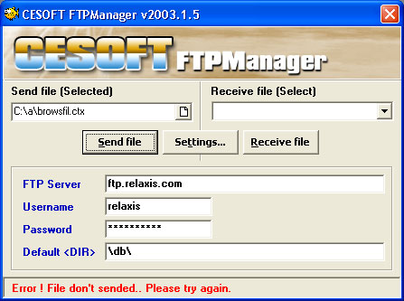



## Mini FTP Manager \- Send/Receive

### Description

Mini FTP Manager very easy but useful FTP send receive program. this program based on 1 line send and 1 line receive file method. Very easy, to adapting all applications.
 
### More Info
 
All functions and routines are declared.

             |
---                |---
**Submitted On**   |2003-06-01 13:01:00
**By**             |[B\.Cem HANER](https://github.com/Planet-Source-Code/PSCIndex/blob/master/ByAuthor/b-cem-haner.md)
**Level**          |Intermediate
**User Rating**    |5.0 (15 globes from 3 users)
**Compatibility**  |VB 5\.0, VB 6\.0
**Category**       |[Internet/ HTML](https://github.com/Planet-Source-Code/PSCIndex/blob/master/ByCategory/internet-html__1-34.md)
**World**          |[Visual Basic](https://github.com/Planet-Source-Code/PSCIndex/blob/master/ByWorld/visual-basic.md)
**Archive File**   |[Mini\_FTP\_M16886512312003\.zip](https://github.com/Planet-Source-Code/b-cem-haner-mini-ftp-manager-send-receive__1-50693/archive/master.zip)

